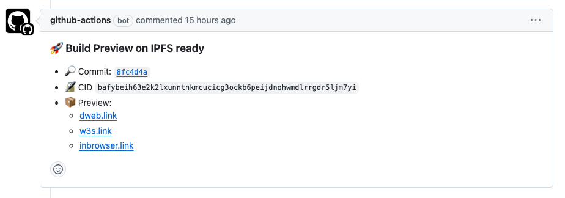

# Deploy to IPFS Action

This GitHub Action automates the deployment of static sites to IPFS using [CAR files](https://docs.ipfs.tech/concepts/glossary/#car). It pins to [Storacha](https://storacha.network) and optionally to [Pinata](https://pinata.cloud). The action will automatically create a preview link and update your PR/commit status with the deployment information.

The [composite action](https://docs.github.com/en/actions/sharing-automations/creating-actions/about-custom-actions#composite-actions) makes no assumptions about your build process. You should just run your build and then call this action (as a step in an existing job) with the `path-to-deploy` input set to the path of your build output directory.




## Features

- 📦 Merkleizes your static site into a CAR file
- 🚀 Uploads CAR file to either Storacha, IPFS Cluster, or Kubo
- 📍 Optional pinning to Pinata
- 💾 Optional CAR file upload to Filebase
- 💬 PR comment with CID and preview links
- 🔗 Automatic preview links
- ✅ Commit status updates

## How does this compare to the other IPFS actions?

This action encapsulates the established best practices for deploying static sites to IPFS in 2025

- Merkleizes the build into a CAR file in GitHub Actions using `ipfs-car`. This ensures that the CID is generated in the build process and is the same across multiple providers.
- Uploads the CAR file to IPFS via [Storacha](https://storacha.network).
- Optionally pins the CID of the CAR file to Pinata. This is useful for redundancy (multiple providers). The pinning here is done in the background and non-blocking. (When pinning, Pinata will fetch the data from Storacha.)
- Updates the PR/commit status with the deployment information and preview links.

## Storacha configuration

To set up the Storacha, you will need to install [w3cli](https://github.com/storacha/w3cli) and login with your Storacha account.

Once logged in:

- [Create a new space](https://docs.storacha.network/how-to/ci/#create-a-space) (like an S3 bucket) to which you will upload the merkleized CAR files.
- [Create a signing key](https://docs.storacha.network/how-to/ci/#create-a-signing-key) that will be used in CI to sign requests to Storacha.
- [Create a UCAN proof](https://docs.storacha.network/how-to/ci/#create-a-proof) that will be used in CI to sign requests to Storacha.

The signing key and proof will be used as [inputs](#inputs) to the action.

## Inputs

### Required Inputs

| Input              | Description                                                                                                                                                                                                  |
| ------------------ | ------------------------------------------------------------------------------------------------------------------------------------------------------------------------------------------------------------ |
| `path-to-deploy`   | Path to the directory containing the frontend build to merkleize into a CAR file and deploy to IPFS                                                                                                          |
| `github-token`     | GitHub token for updating commit status and PR comments                                                                                                                                                      |
| `kubo-api-url`     | Kubo RPC API URL to pass to `ipfs --api`, e.g. `/dns/YOUR_DOMAIN/tcp/443/https`                                                                                                                              |
| `kubo-api-auth`    | Kubo RPC API auth secret to pass to `ipfs --api-auth`, e.g. `basic:hello:world` (defined as `AuthSecret` in `API.Authorizations` config)                                                                     |
| `cluster-url`      | IPFS Cluster URL to pass to `ipfs-cluster-ctl --host`                                                                                                                                                        |
| `cluster-user`     | IPFS Cluster username for basic http auth                                                                                                                                                                    |
| `cluster-password` | IPFS Cluster password for basic http auth                                                                                                                                                                    |
| `storacha-key`     | Storacha base64 encoded key to use to sign UCAN invocations. Create one using `w3 key create --json`. See: https://github.com/storacha/w3cli#w3_principal                                                    |
| `storacha-proof`   | Storacha Base64 encoded proof UCAN with capabilities for the space. Create one using `w3 delegation create did:key:DID_OF_KEY -c space/blob/add -c space/index/add -c filecoin/offer -c upload/add --base64` |

> [!IMPORTANT]
> To use this action, you must configure the inputs for either: **Kubo, IPFS Cluster, or Storacha**.
>
> - Kubo: `kubo-api-url` and `kubo-api-auth`
> - IPFS Cluster: `cluster-url`, `cluster-user`, `cluster-password`
> - Storacha: `storacha-key`, `storacha-proof`

### Optional Inputs

| Input                 | Description                                             | Default                          |
| --------------------- | ------------------------------------------------------- | -------------------------------- |
| `node-version`        | Node.js version to use                                  | `'20'`                           |
| `cluster-ctl-version` | IPFS Cluster CLI version to use                         | `'v1.1.2'`                       |
| `kubo-version`        | Kubo CLI version to use for pinning API and CAR uploads | `'v0.33.0'`                      |
| `pinata-pinning-url`  | Pinata Pinning Service URL                              | `'https://api.pinata.cloud/psa'` |
| `pinata-jwt-token`    | Pinata JWT token for authentication                     | -                                |
| `filebase-bucket`     | Filebase bucket name                                    | -                                |
| `filebase-access-key` | Filebase access key                                     | -                                |
| `filebase-secret-key` | Filebase secret key                                     | -                                |
| `set-github-status`   | Set GitHub commit status and PR comments                | `'true'`                         |

## Outputs

| Output | Description                          |
| ------ | ------------------------------------ |
| `cid`  | The IPFS CID of the uploaded content |

## Usage

See the [IPNS Inspector](https://github.com/ipfs/ipns-inspector/blob/main/.github/workflows/build.yml) for a real-world example of this action in use.

Here's a basic example of how to use this action in your workflow:

```yaml
name: Build and Deploy to IPFS

permissions:
  contents: read
  pull-requests: write
  statuses: write
on:
  push:
    branches:
      - main
  pull_request:

jobs:
  build-and-deploy:
    runs-on: ubuntu-latest
    outputs: # This exposes the CID output of the action to the rest of the workflow
      cid: ${{ steps.deploy.outputs.cid }}
    steps:
      - name: Checkout code
        uses: actions/checkout@v4

      - name: Setup Node.js
        uses: actions/setup-node@v4
        with:
          node-version: '20'
          cache: 'npm'

      - name: Install dependencies
        run: npm ci

      - name: Build project
        run: npm run build

      - uses: ./.github/actions/deploy-to-ipfs
        name: Deploy to IPFS
        id: deploy
        with:
          path-to-deploy: out
          storacha-key: ${{ secrets.STORACHA_KEY }}
          storacha-proof: ${{ secrets.STORACHA_PROOF }}
          github-token: ${{ github.token }}
```

## FAQ

- What's the difference between uploading a CAR and using the Pinning API?
  - Since the CAR is like a tarball of the full build with some additional metadata (merkle proofs), the upload will be as big as the build output. Pinning with the [Pinning API](https://github.com/ipfs/pinning-services-api-spec) in contrast is just a request to instruct the pinning service to retrieve and pin the data. At the time this action is first released, CAR uploads is supported by Kubo, Storacha, and Filebase, but not Pinata.
